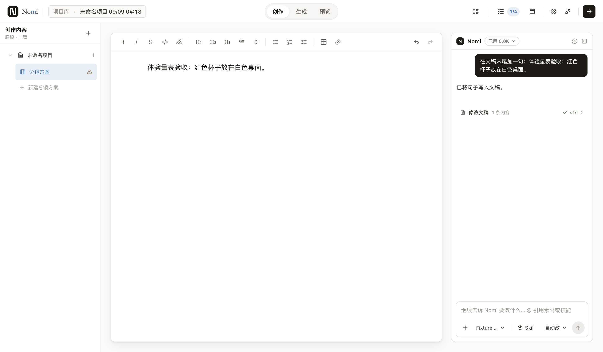
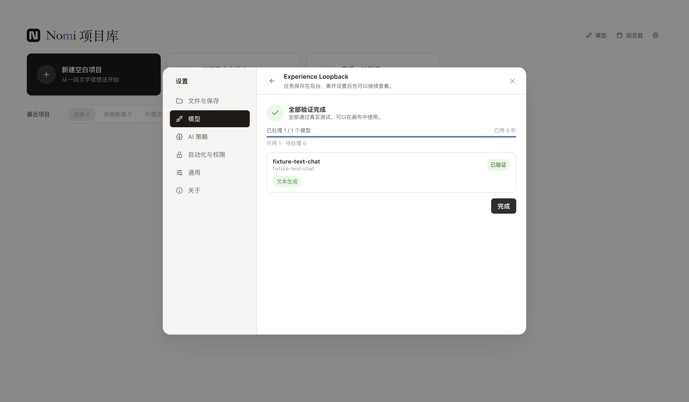

# 体验量表首轮验收（2026-09-09）

三条任务通过真实 Electron UI、IPC、SDK 与落盘路径；供应商由本机 loopback 固定响应代替，费用 0。图片返回仓库固定插画，不证明提示词符合度。

[完整证据包](2026-09-09-ux-experience-rubric/evidence.zip) 含每步前后截图、DOM、事件、时序、哈希、逐维报告和一次 synthetic 判官接口示例。解压后打开 report.md；ZIP 收据见同目录 receipt.json。轨迹 trace.zip 保留本机 artifacts/experience/runs。

| 任务 | 点击 | 输入 | 键盘 | 切面板 | 指针距离 | Fitts 累计 |
| --- | --- | --- | --- | --- | --- | --- |
| agent-panel | 5 | 1 | 1 | 1 | 1620.5px | 12.00 |
| canvas-image | 7 | 1 | 0 | 4 | 2495.1px | 20.89 |
| settings-model | 7 | 3 | 0 | 3 | 2559.0px | 16.75 |

初次基线是测量现状，不是体验获认可。画布旅程显式选择指定模型（包括模型已默认选中时），比较必须保持这一任务前提，不能与省略模型选择的快捷路径混算。实际 viewport 1440×842、DPR 2、light；平台 macOS arm64，Electron 43.4.1。

| 维度 | Agent | 画布 | 设置 |
| --- | --- | --- | --- |
| 链路长度 | 待评审 | 待评审 | 待评审 |
| 每步可理解 | 待评审 | 待评审 | 待评审 |
| 图标可懂 | 机械 3/3（0 提醒） | 机械 3/3（0 提醒） | 机械 3/3（0 提醒） |
| 文案简洁 | 机械 3/3（0 提醒） | 机械 3/3（0 提醒） | 机械 1/3（1 提醒） |
| 目标可理解 | 待评审 | 待评审 | 待评审 |
| 整齐 | 待评审 | 待评审 | 待评审 |
| 空间舒适 | 待评审 | 待评审 | 待评审 |
| 伸手 | 待评审 | 待评审 | 待评审 |
| 速度 | 机械 3/3（0 提醒） | 机械 3/3（0 提醒） | 机械 3/3（0 提醒） |
| 机械体感缺陷 | 机械 1/3（7 提醒） | 机械 1/3（8 提醒） | 机械 1/3（10 提醒） |

## 人眼复核与分诊（只列不修）

已逐步看接触表，并放大检查三个终态。以下是候选和调查方向，未把扫描器的重复 finding 当成已确认 bug。

| 维度 | 证据 | 疑似 owner | 建议 |
| --- | --- | --- | --- |
| 链路/伸手 | Agent 选模型要打开弹层、再开对话模型下拉、选择、Escape；总 5 次点击与 1 次键盘 | src/workbench/ai | 对照新用户是否理解两层模型选择；不因多一步自动砍掉安全确认 |
| 文案简洁 | 设置流程单屏最大 9 个控件超项目字数线；证据包 settings-model 各步 DOM | src/ui/onboarding/ModelSettingsHome.tsx | 区分导航复合行与真正按钮文案，避免把含说明的卡片整体当短按钮 |
| 机械体感 | Agent/画布/设置单屏峰值分别 12/61/78 个第一层候选 | tests/ux/_feel.mjs；对应 UI owner | 模态打开时背景控件被覆盖属预期；先按活动对话框范围分诊，不能称 78 个产品缺陷 |
| 图标/理解 | 画布左侧加节点栏主要是图标，目标和工具行与输入区分散；无名 icon 数为 0 | src/workbench/generationCanvas | 做不含 tooltip/名称的盲猜，当前不能报正确率 |
| 速度 | 操作时序保存在每步 metrics；loopback 下 Agent 发送动作也可能超过 1s 提醒线 | src/workbench/ai | 用 trace 区分 Playwright 等待与产品响应；真实服务时间本轮未测 |
| 空间/整齐 | 三个终态主要内容可见，设置页成功反馈清楚；多个小目标与布局候选留在 DOM | src/workbench/settings、src/workbench/generationCanvas | 按同组可比边缘复核，不用密度单值判断舒适 |

## 终态证据

## 机制验证

7 个 node:test 通过，覆盖失败/缺终态/缺最后步骤/缺图/哈希变化/无可信事件/漏指标/恶化棘轮/新口径/跨 run 混证据/非法 VLM 分数；实际三任务 25 阶段、50 张前后截图全部通过。基线初始化后 experience:report 再执行通过；manual-example 一次通过，synthetic、0 次模型调用。`pnpm run gates` 完整通过：阻断 contracts 全绿；Vitest 12058 通过 / 2 跳过，Agent runtime 306 项通过，其余附加测试与构建通过。文档索引/状态/调研来源为项目指定 advisory，不阻断。

## 零付费判官手动示例

[本会话视觉评审 JSON](2026-09-09-ux-experience-rubric/manual-visual-review.json) 对 Agent 的真实截图给出逐维分与理由，已通过同一 judgeWithAdapter 响应校验。它是当前助手手工看图后的辅助判断，没有另调模型 API，也不是 Opus 实跑或真人用户研究；盲猜、对标、速度等证据不足维度保持 null。离线报告和棘轮未被这些主观分覆盖。
