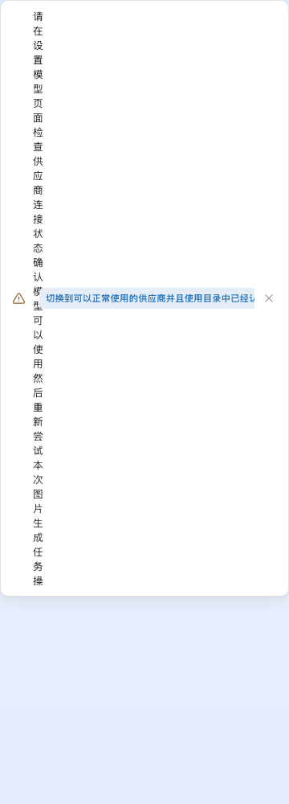
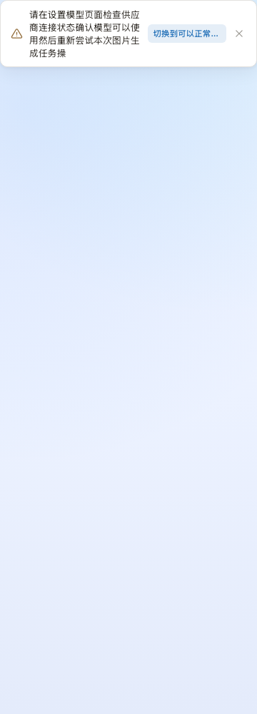
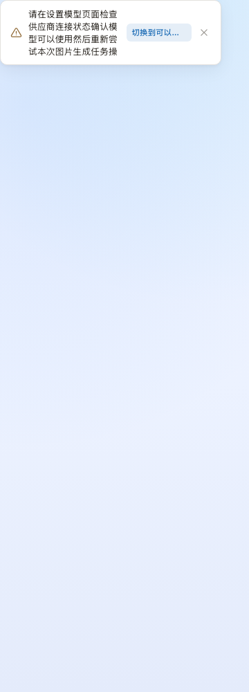
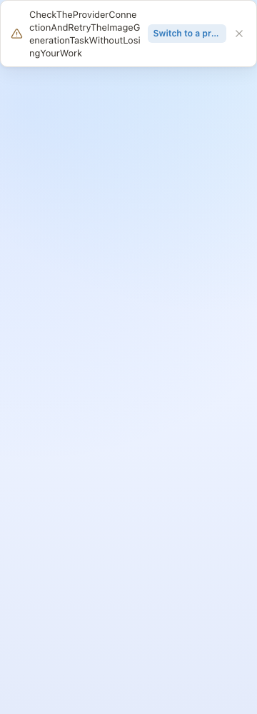

# Toast 长动作布局：根因与同构扫描

状态：共享 toast 已实现；完整 gates exit 0，待 PR 审核。基线 `2baa00d5e6edb146f8dfe9dc48aca8f766c09444`。

## 红 → 绿

真实 `buildToastNotification` → Mantine `Notification`，复用生产 theme、CSS；容器 360px，正文 40 中文字符、动作 30 中文字符。修前每行 1 字，共 40 行，测试明确失败。修后中文每行 12/11/10 字（360/344/320px），40 字均为 4 行。180px 宿主会保底到 320px，仍在 360px 视口内；英文连续长串也能换行，动作宽度不超过内容区 40%，完整标签在 title 与可访问名称中。






复跑：`node scripts/build-tailwind.mjs && pnpm exec tsx --test tests/ux/toast-layout.spec.ts`。浏览器断言与截图使用同一夹具；它不混入无浏览器的 Vitest 单元道。`src/ui/toast.test.ts` 覆盖动作可访问性、关闭顺序、生命周期与原位更新。修前失败输出：[red.txt](toast-action-layout/red.txt)。图已人眼查看：从一字一行恢复可读段落，关闭按钮与动作均保留。

## 真正生产者与命名来源

给出的 `useNodeModelAutoSelect.ts` 只调用无动作的 `showInfoToast`，没有“切到 X”按钮。当前 origin/main 的 `actionLabel`、`useToastStore` 和“切到”全仓搜索均未找到该生产者。已只读定位：`/Users/aoqimin/Desktop/Nomi-money-guard` 的 B4 未提交改动，`useNodeModelAutoSelect.ts:238` 正是生产者；共同基线同为 `2baa00d5`。名称修正与测试见 [B4 补丁](toast-action-layout/b4-display-names.patch)，尚未应用或运行，避免把 B4 行为改动夹带进本 PR。

现有显示名真源：`src/config/modelCatalogCache.ts:101` 读取 catalog vendor.name，`:158` 投影到 `ModelOption.vendorName`；模型使用 `ModelOption.label`，供应商 key 不应用作界面标签。B4 已经使用 `target.label`（`modelOptionMappers.ts:52` 直接读取目录 labelZh，不生成 title case）。截图的 `Gpt Image 2` 若仍存在，应检查对应目录行本身；本修复不猜改用户目录名称。供应商修正补丁使用同一目录投影的 `target.vendorName`。补丁尚未接入，不能声称动作名称已修。

## 同构判断

这是通用布局类问题，不限供应商或模型。撤销、批量重试、用户命名的相机选择均经过 ToastMessage，统一得到修复。toast 外的候选按用户要求列入本报告，未擅动冻结区或审批行为。

任务中心 `TaskCenterPanel.tsx:387`：正文与阶段行都有 truncate，三个操作是固定翻译，不会出现 5 行竖字；超长翻译有挤压风险。审批头 `AgentPanelV4Cards.tsx:213`：标题可换行，badge 无宽度预算；`agentPanelV4Intervention.ts:185` 当前只映射不可逆/可撤销/费用三种翻译，属于潜在同构风险。它的 `:238` detail 与 `:359` actions 也可挤压主标签，因正文 truncate 表现为文字消失而非竖字。

`VendorOnboardCard.tsx:367` 动态推广 CTA、`FoldableModelCard.tsx:65` headerAction、`ModelSettingsWorkspacePages.tsx:43` actions 均有类似插槽风险，列入下表。`ModelAdapterStatusSection.tsx:108` 在小视口转 flex-col，但只按视口断点，不按宿主容器宽度；桌面窄面板仍值得独立验证。

## 全仓候选清单

AST 初扫匹配 flex 父元素、直接 min-w-0 flex-1 子元素，以及其它兄弟子树中 shrink-0 且无 max-w/truncate/line-clamp；包含条件 JSX、固定图标、纵向布局等保守候选。源码扫描不是浏览器验收；“未实测”不等于通过。共 89 个候选（原输出因多行 className 占 105 行）。行号均为修复前基线。

| 文件:行 | 窄容器是否复现 / 处置 |
|---|---|
| `src/devlab/designLab/v4/states/03-flow.tsx:91` | 纵向/响应式布局候选，不能仅由该模式判为竖字；未实测 |
| `src/workbench/WorkbenchShell.tsx:271` | 固定翻译/计数/操作区候选；尚无竖字实测，列入报告，不宣称安全 |
| `src/design/NomiSelect.tsx:235` | 正文单行截断，不发生多行竖字；仍可能被挤到不可见，未实测 |
| `src/design/actions.tsx:182` | 主要为固定尺寸图标/侧栏，非任意长动作标签；未实测窄容器 |
| `src/workbench/taskCenter/TaskCenterPanel.tsx:387` | 当前不竖排：正文 truncate；动作只有重试/取消/中断。超长翻译仍有挤压风险，列入报告 |
| `src/workbench/settings/VendorPreferenceOrderSection.tsx:68` | 正文单行截断，不发生多行竖字；仍可能被挤到不可见，未实测 |
| `src/workbench/settings/SettingsDialog.tsx:257` | 固定翻译/计数/操作区候选；尚无竖字实测，列入报告，不宣称安全 |
| `src/workbench/settings/AutomationPermissionsSection.tsx:217` | 固定翻译/计数/操作区候选；尚无竖字实测，列入报告，不宣称安全 |
| `src/workbench/settings/AboutSection.tsx:43` | 主要为固定尺寸图标/侧栏，非任意长动作标签；未实测窄容器 |
| `src/workbench/sidebar/NodeItem.tsx:52` | 正文单行截断，不发生多行竖字；仍可能被挤到不可见，未实测 |
| `src/workbench/sidebar/GroupItem.tsx:156` | 正文单行截断，不发生多行竖字；仍可能被挤到不可见，未实测 |
| `src/ui/onboarding/ModelPickerScreen.tsx:335` | 固定翻译/计数/操作区候选；尚无竖字实测，列入报告，不宣称安全 |
| `src/ui/onboarding/FoldableModelCard.tsx:65` | 动态兄弟文本/插槽：同构风险，长输入待专项验证（本报告保留） |
| `src/ui/onboarding/FoldableModelCard.tsx:66` | 动态兄弟文本/插槽：同构风险，长输入待专项验证（本报告保留） |
| `src/ui/onboarding/ModelSettingsHome.tsx:114` | 动态兄弟文本/插槽：同构风险，长输入待专项验证（本报告保留） |
| `src/ui/onboarding/ModelSettingsHome.tsx:166` | 动态兄弟文本/插槽：同构风险，长输入待专项验证（本报告保留） |
| `src/ui/onboarding/ModelSettingsHome.tsx:236` | 动态兄弟文本/插槽：同构风险，长输入待专项验证（本报告保留） |
| `src/ui/onboarding/ComfyuiWorkflowImportPanel.tsx:502` | 固定翻译/计数/操作区候选；尚无竖字实测，列入报告，不宣称安全 |
| `src/ui/onboarding/ComfyuiWorkflowImportPanel.tsx:570` | 主要为固定尺寸图标/侧栏，非任意长动作标签；未实测窄容器 |
| `src/ui/onboarding/ComfyuiTemplateLibrary.tsx:160` | 固定翻译/计数/操作区候选；尚无竖字实测，列入报告，不宣称安全 |
| `src/ui/onboarding/ComfyuiTemplateLibrary.tsx:261` | 正文单行截断，不发生多行竖字；仍可能被挤到不可见，未实测 |
| `src/ui/onboarding/workflowPage/WorkflowNodeMenu.tsx:132` | 正文单行截断，不发生多行竖字；仍可能被挤到不可见，未实测 |
| `src/ui/onboarding/workflowPage/WorkflowCanvasPreview.tsx:155` | 正文单行截断，不发生多行竖字；仍可能被挤到不可见，未实测 |
| `src/ui/onboarding/workflowPage/WorkflowSidebar.tsx:178` | 固定翻译/计数/操作区候选；尚无竖字实测，列入报告，不宣称安全 |
| `src/ui/onboarding/workflowPage/WorkflowSidebar.tsx:185` | 主要为固定尺寸图标/侧栏，非任意长动作标签；未实测窄容器 |
| `src/ui/onboarding/workflowPage/WorkflowSidebar.tsx:238` | 主要为固定尺寸图标/侧栏，非任意长动作标签；未实测窄容器 |
| `src/ui/onboarding/VendorOnboardCard.tsx:367` | 动态兄弟文本/插槽：同构风险，长输入待专项验证（本报告保留） |
| `src/ui/onboarding/VendorBaseUrlField.tsx:147` | 正文单行截断，不发生多行竖字；仍可能被挤到不可见，未实测 |
| `src/ui/onboarding/ModelSettingsWorkspacePages.tsx:43` | 动态兄弟文本/插槽：同构风险，长输入待专项验证（本报告保留） |
| `src/ui/onboarding/ModelSettingsWorkspacePages.tsx:107` | 固定翻译/计数/操作区候选；尚无竖字实测，列入报告，不宣称安全 |
| `src/ui/onboarding/ModelChipGroups.tsx:82` | 正文单行截断，不发生多行竖字；仍可能被挤到不可见，未实测 |
| `src/ui/onboarding/OnboardingWizard.tsx:436` | 主要为固定尺寸图标/侧栏，非任意长动作标签；未实测窄容器 |
| `src/ui/onboarding/KnownVendorKeyConnectPage.tsx:163` | 主要为固定尺寸图标/侧栏，非任意长动作标签；未实测窄容器 |
| `src/ui/onboarding/ComfyuiPresetSection.tsx:105` | 固定翻译/计数/操作区候选；尚无竖字实测，列入报告，不宣称安全 |
| `src/ui/onboarding/ComfyuiPresetSection.tsx:150` | 正文单行截断，不发生多行竖字；仍可能被挤到不可见，未实测 |
| `src/ui/onboarding/DirectScriptDraftForm.tsx:17` | 主要为固定尺寸图标/侧栏，非任意长动作标签；未实测窄容器 |
| `src/ui/onboarding/ModelAdapterStatusSection.tsx:108` | 纵向/响应式布局候选，不能仅由该模式判为竖字；未实测 |
| `src/ui/onboarding/ModelAdapterStatusSection.tsx:109` | 主要为固定尺寸图标/侧栏，非任意长动作标签；未实测窄容器 |
| `src/ui/onboarding/ModelEnableEditor.tsx:174` | 正文单行截断，不发生多行竖字；仍可能被挤到不可见，未实测 |
| `src/ui/onboarding/ModelEnableEditor.tsx:203` | 正文单行截断，不发生多行竖字；仍可能被挤到不可见，未实测 |
| `src/ui/onboarding/IntegrationConfirmationPanel.tsx:82` | 主要为固定尺寸图标/侧栏，非任意长动作标签；未实测窄容器 |
| `src/ui/onboarding/CustomVendorManage.tsx:234` | 固定翻译/计数/操作区候选；尚无竖字实测，列入报告，不宣称安全 |
| `src/ui/toast.tsx:56` | 已复现（40 行竖字），共享层已修；360/344/320 实测通过 |
| `src/ui/onboarding/ModelSettingsPageSurface.tsx:25` | 主要为固定尺寸图标/侧栏，非任意长动作标签；未实测窄容器 |
| `src/ui/onboarding/LocalModelCard.tsx:206` | 固定翻译/计数/操作区候选；尚无竖字实测，列入报告，不宣称安全 |
| `src/ui/onboarding/LocalModelCard.tsx:239` | 正文单行截断，不发生多行竖字；仍可能被挤到不可见，未实测 |
| `src/ui/onboarding/ModelCapabilityEditor.tsx:337` | 固定翻译/计数/操作区候选；尚无竖字实测，列入报告，不宣称安全 |
| `src/ui/onboarding/ModelCapabilityEditor.tsx:355` | 主要为固定尺寸图标/侧栏，非任意长动作标签；未实测窄容器 |
| `src/ui/onboarding/AdapterTaskWorkspace.tsx:39` | 固定翻译/计数/操作区候选；尚无竖字实测，列入报告，不宣称安全 |
| `src/ui/onboarding/AdapterTaskWorkspace.tsx:40` | 主要为固定尺寸图标/侧栏，非任意长动作标签；未实测窄容器 |
| `src/ui/community/FeedbackShareContent.tsx:44` | 主要为固定尺寸图标/侧栏，非任意长动作标签；未实测窄容器 |
| `src/ui/app-shell/UpdaterDialog.tsx:49` | 主要为固定尺寸图标/侧栏，非任意长动作标签；未实测窄容器 |
| `src/workbench/creation/storyboard/StoryboardPlanStrategyPanel.tsx:49` | 固定翻译/计数/操作区候选；尚无竖字实测，列入报告，不宣称安全 |
| `src/workbench/creation/storyboard/StoryboardPlanStrategyPanel.tsx:187` | 动态兄弟文本/插槽：同构风险，长输入待专项验证（本报告保留） |
| `src/workbench/creation/storyboard/StoryboardShotTable.tsx:252` | 固定翻译/计数/操作区候选；尚无竖字实测，列入报告，不宣称安全 |
| `src/workbench/creation/storyboard/StoryboardActionCard.tsx:47` | 固定翻译/计数/操作区候选；尚无竖字实测，列入报告，不宣称安全 |
| `src/workbench/creation/storyboard/shotRow/ShotReferenceSlotPopover.tsx:73` | 主要为固定尺寸图标/侧栏，非任意长动作标签；未实测窄容器 |
| `src/workbench/creation/DocumentListSidebar.tsx:279` | 正文限制两行，不满足 ≥5 行竖字条件；窄容器未实测 |
| `src/workbench/creation/DocumentListSidebar.tsx:347` | 正文限制两行，不满足 ≥5 行竖字条件；窄容器未实测 |
| `src/ui/browser/dialog/NomiBrowserDialogModel.tsx:443` | 主要为固定尺寸图标/侧栏，非任意长动作标签；未实测窄容器 |
| `src/ui/browser/dialog/NomiBrowserDialogView.tsx:295` | 正文单行截断，不发生多行竖字；仍可能被挤到不可见，未实测 |
| `src/ui/browser/dialog/NomiBrowserDialogView.tsx:369` | 固定翻译/计数/操作区候选；尚无竖字实测，列入报告，不宣称安全 |
| `src/ui/browser/dialog/NomiBrowserDialogView.tsx:434` | 主要为固定尺寸图标/侧栏，非任意长动作标签；未实测窄容器 |
| `src/ui/browser/popover/BrowserAssetPopoverParts.tsx:88` | 固定翻译/计数/操作区候选；尚无竖字实测，列入报告，不宣称安全 |
| `src/ui/browser/popover/BrowserAssetPopoverView.tsx:162` | 正文单行截断，不发生多行竖字；仍可能被挤到不可见，未实测 |
| `src/ui/browser/popover/BrowserAssetPopoverView.tsx:204` | 正文单行截断，不发生多行竖字；仍可能被挤到不可见，未实测 |
| `src/ui/browser/popover/BrowserAssetPopoverView.tsx:275` | 正文单行截断，不发生多行竖字；仍可能被挤到不可见，未实测 |
| `src/ui/browser/popover/BrowserAssetPopoverView.tsx:280` | 正文单行截断，不发生多行竖字；仍可能被挤到不可见，未实测 |
| `src/workbench/ai/v4/AgentPanelV4Cards.tsx:213` | 同构潜在风险：badge 当前由三种固定翻译产生；注入长 badge 可挤压，未实测，列入报告 |
| `src/workbench/ai/v4/AgentPanelV4Cards.tsx:238` | 正文单行截断，不发生多行竖字；仍可能被挤到不可见，未实测 |
| `src/workbench/ai/v4/AgentPanelV4Cards.tsx:359` | 正文单行截断，不发生多行竖字；仍可能被挤到不可见，未实测 |
| `src/workbench/skillLibrary/SkillCard.tsx:31` | 正文单行截断，不发生多行竖字；仍可能被挤到不可见，未实测 |
| `src/workbench/library/WorkflowLibraryContent.tsx:102` | 主要为固定尺寸图标/侧栏，非任意长动作标签；未实测窄容器 |
| `src/workbench/library/WorkflowLibraryContent.tsx:128` | 正文单行截断，不发生多行竖字；仍可能被挤到不可见，未实测 |
| `src/workbench/generationCanvas/nodes/ProductionShotPlaceholder.tsx:133` | 主要为固定尺寸图标/侧栏，非任意长动作标签；未实测窄容器 |
| `src/workbench/assets/AssetMentionSuggestionList.tsx:88` | 正文单行截断，不发生多行竖字；仍可能被挤到不可见，未实测 |
| `src/workbench/generationCanvas/nodes/ClipNode.tsx:615` | 固定翻译/计数/操作区候选；尚无竖字实测，列入报告，不宣称安全 |
| `src/workbench/generationCanvas/nodes/NodeDeconstructionPanel.tsx:193` | 固定翻译/计数/操作区候选；尚无竖字实测，列入报告，不宣称安全 |
| `src/workbench/generationCanvas/nodes/render/NodeEmptyState.tsx:16` | 纵向/响应式布局候选，不能仅由该模式判为竖字；未实测 |
| `src/workbench/generationCanvas/nodes/NodeResultStack.tsx:379` | 固定翻译/计数/操作区候选；尚无竖字实测，列入报告，不宣称安全 |
| `src/workbench/generationCanvas/nodes/render/AudioStripNode.tsx:192` | 正文限制两行，不满足 ≥5 行竖字条件；窄容器未实测 |
| `src/workbench/generationCanvas/nodes/DeconstructionShotRow.tsx:42` | 固定翻译/计数/操作区候选；尚无竖字实测，列入报告，不宣称安全 |
| `src/workbench/generationCanvas/nodes/DeconstructionShotRow.tsx:118` | 固定翻译/计数/操作区候选；尚无竖字实测，列入报告，不宣称安全 |
| `src/workbench/generationCanvas/nodes/whiteboard/WhiteboardLibraryPanel.tsx:84` | 正文单行截断，不发生多行竖字；仍可能被挤到不可见，未实测 |
| `src/workbench/generationCanvas/nodes/artifact/ArtifactBody.tsx:182` | 正文单行截断，不发生多行竖字；仍可能被挤到不可见，未实测 |
| `src/workbench/generationCanvas/nodes/scene3d/Scene3DFullscreen.tsx:538` | 固定翻译/计数/操作区候选；尚无竖字实测，列入报告，不宣称安全 |
| `src/workbench/generationCanvas/nodes/scene3d/Scene3DFullscreenHeader.tsx:48` | 固定翻译/计数/操作区候选；尚无竖字实测，列入报告，不宣称安全 |
| `src/workbench/generationCanvas/nodes/scene3d/trajectory/TrajectoryPanel.tsx:169` | 正文单行截断，不发生多行竖字；仍可能被挤到不可见，未实测 |
| `src/workbench/generationCanvas/nodes/scene3d/trajectory/TrajectoryPanel.tsx:346` | 正文单行截断，不发生多行竖字；仍可能被挤到不可见，未实测 |

## 复跑扫描器

将下列脚本保存为仓库根目录下临时 `.cjs`，运行 `node <script>`；源码行号随修复会移动。

```javascript
const ts=require('typescript'); const fs=require('fs'); const cp=require('child_process');
const paths=cp.execFileSync('rg',['--files','src','electron'],{encoding:'utf8'}).trim().split('\n').filter(p=>p.endsWith('.tsx'));
const cls=n=>{const a=(n.openingElement||n).attributes?.properties?.find(p=>p.name?.text==='className');return a?.initializer?.getText()||''};
for(const p of paths){const s=ts.createSourceFile(p,fs.readFileSync(p,'utf8'),ts.ScriptTarget.Latest,true,ts.ScriptKind.TSX);function visit(n){if(ts.isJsxElement(n)&&/\bflex\b/.test(cls(n))){const children=n.children.filter(ts.isJsxElement);const bodies=children.filter(c=>/\bflex-1\b/.test(cls(c))&&/\bmin-w-0\b/.test(cls(c))); if(bodies.length){const siblings=n.children.filter(c=>!bodies.includes(c));const bad=siblings.filter(c=>/shrink-0/.test(c.getText())&&!/max-w-|truncate|line-clamp/.test(c.getText()));if(bad.length) console.log(`${p}:${s.getLineAndCharacterOfPosition(n.getStart()).line+1} | BODY ${bodies.map(cls).join(' ')} | SIBLING ${bad.map(x=>x.getText().slice(0,420).replace(/\s+/g,' ')).join(' ')}`)}}ts.forEachChild(n,visit)}visit(s)}
```

## 验证收据

- `python3 scripts/with-gates-lock.py -- pnpm run gates`：exit 0。76 contracts：73 通过，0 阻断失败，3 advisory（docs-index / doc-status / research-sources）。
- 设计实验室：153 passed；Vitest：1303 文件通过、1 文件跳过；12118 测试通过、2 跳过。Agent runtime：306 测试通过。Vite 与 Electron 构建通过。
- 窄容器浏览器断言：中文 360/344/320/180、英文 360 五组通过；[输出](toast-action-layout/green.txt)。
- 推送前刷新 origin/main：仍为 `2baa00d5`，ahead/behind = 0/0（任务提交前）。没有触碰冻结区或 C50 行为。
- 每日雷达：KIE/APIMart 合计发现 6 个新增条目；apimart-llm 因 safeStorage 凭据无法解密未查成。未更新快照，雷达输出留在 `.tmp/toast-radar-latest.json`；本机未找到 nomi-model-radar / nomi-research-radar 技能，未完成后续分诊/论文雷达。
