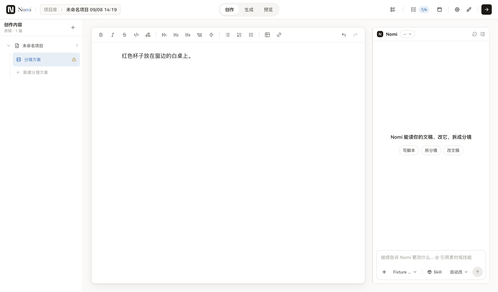
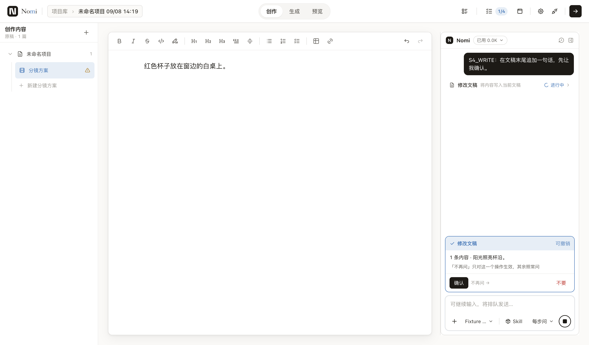
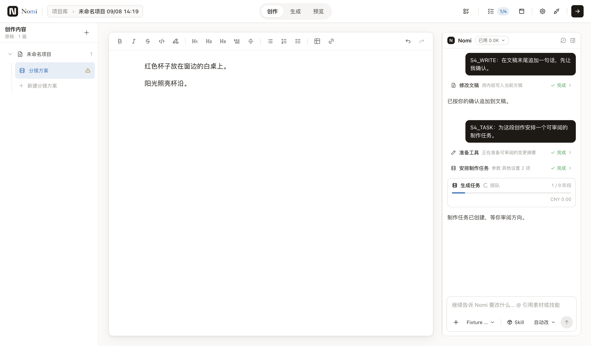
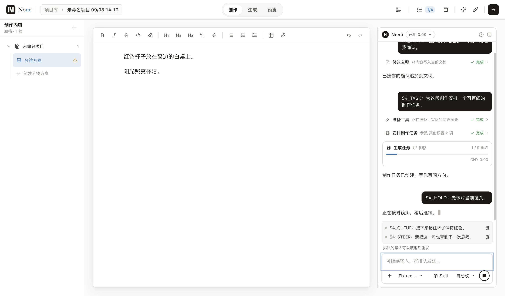

# 阶段 4：Agent lane 原子切换

状态：🚧 实施中（六个里程碑；只开 PR，不合并）

## 范围与基线

用户打开 Agent 面板时改走 pi lane；同一 PR 迁旧对话并删除旧宿主、旧运行时。现有 v4 组件和 62 张视觉基线不改形态。没有开关、旧路 fallback 或兼容 re-export。

基线：`origin/main` / `906ef9ab0a45d22b4cc8d016755e1c374b85373c`（2026-09-08，delivery:preflight = same-commit、clean）。开工三行通过；依赖只按现有锁文件安装，不增包。用户 09-08 补记优先于 [深方案 §2](2026-09-07-agent-rebuild-stage3-5-deep-plan.md#2-阶段-4--切换删旧)。

不动：G5 领域收据、其他 worktree、主 checkout、真实项目数据、付费模型、__baselines__。本机语料仅运行只读聚合计数，不输出路径、消息或参数。

## 今日删除清单与承接点

生产/测试分开数：宿主 **48 文件 / 9,110 行**，宿主目录另有 **25 测试 / 13,111 行**；运行时 **13 文件 / 1,071 行**。下面的行数按 `splitlines()`，importers 按 tracked 源文件相对 import 解析；含测试、含组内消费者，不能误称“外部引用为零”。

| 组 | 删除生产文件 / 行 | 谁承接（当前基线锚点） |
|---|---:|---|
| G1 状态与归约 | 18 / 2551 | `electron/shared/agentLane/laneProjection.ts:187` |
| G2 线程与回合 | 7 / 1339 | `electron/agentLane/laneWorkspace.mts:39` |
| G3 队列编辑 | 2 / 244 | `src/workbench/ai/lane/laneClient.ts:161` |
| G4 审批与提案 | 5 / 761 | `electron/agentLane/laneApprovalGate.ts:111` |
| G6 执行协调 | 5 / 1595 | `electron/agentLane/laneTools.mts:160` |
| G7 持久化与迁移 | 6 / 1674 | `electron/agentLane/laneSession.mts:163` |
| G8 IPC 与装配 | 3 / 867 | `electron/agentLane/laneIpc.ts:46` |
| G9 分区身份 | 2 / 79 | `electron/agentLane/laneSession.mts:40` |
| G10 渲染投影 | 4 / 1063 | `src/workbench/ai/lane/laneViewModel.ts:228` |
| 旧运行时 旧运行时接缝 | 13 / 1071 | `electron/agentLane/laneRuntimePort.ts:107` |

G5 已搬到 `electron/capabilityCore/`，收据及撤销程序原地保留。G11 用量由 `LaneUsage` 承接；G12 压缩由 pi 承接；G13 任务卡由 `nomi.ui.task` / `LaneTaskFactsResolver` 承接；不重复计算这些组。

三项用户面裁决：G3 暂停取消，显示“排队的指令可以取消后重发”；G5 撤销收据保留；G13 任务卡按 productionRunId 读领域状态。

### 逐文件与消费者

#### G1

| 文件 | 行 | 谁 import 它 |
|---|---:|---|
| `electron/projectAgentHost/projectAgentAssistantStateInvariant.ts` | 34 | `electron/projectAgentHost/projectAgentState.ts`, `electron/projectAgentHost/projectAgentTrustedStateValidation.ts` |
| `electron/projectAgentHost/projectAgentItemSemantics.ts` | 83 | `electron/projectAgentHost/projectAgentProposalReduction.ts`, `electron/projectAgentHost/projectAgentReducer.ts` |
| `electron/projectAgentHost/projectAgentMutationValidation.ts` | 65 | `electron/projectAgentHost/projectAgentAssistantAppendReduction.ts`, `electron/projectAgentHost/projectAgentAssistantFinalReduction.ts`, `electron/projectAgentHost/projectAgentCompactReplay.ts`, `electron/projectAgentHost/projectAgentProposalReduction.ts`, `electron/projectAgentHost/projectAgentQueueEditReduction.ts`, `electron/projectAgentHost/projectAgentQueueMutationReduction.ts`, `electron/projectAgentHost/projectAgentRecordReduction.ts`, `electron/projectAgentHost/projectAgentReducer.ts`, `electron/projectAgentHost/projectAgentThreadActivation.ts`, `electron/projectAgentHost/projectAgentThreadReduction.ts`, `electron/projectAgentHost/projectAgentTurnStartReduction.ts` |
| `electron/projectAgentHost/projectAgentPatchReferences.ts` | 53 | `electron/projectAgentHost/projectAgentState.ts`, `electron/projectAgentHost/projectAgentTrustedStateValidation.ts` |
| `electron/projectAgentHost/projectAgentProvenanceValidation.ts` | 30 | `electron/projectAgentHost/projectAgentProvenanceValidation.test.ts`, `electron/projectAgentHost/projectAgentState.ts` |
| `electron/projectAgentHost/projectAgentRecordReduction.ts` | 123 | `electron/projectAgentHost/projectAgentProposalReduction.ts`, `electron/projectAgentHost/projectAgentReducer.ts`, `electron/projectAgentHost/projectAgentThreadReduction.ts` |
| `electron/projectAgentHost/projectAgentReducer.ts` | 629 | `electron/projectAgentHost/projectAgentActiveThreadReducer.test.ts`, `electron/projectAgentHost/projectAgentAssistantReducer.test.ts`, `electron/projectAgentHost/projectAgentHost.test.ts`, `electron/projectAgentHost/projectAgentHost.ts`, `electron/projectAgentHost/projectAgentProposalReducer.test.ts`, `electron/projectAgentHost/projectAgentQueueEditReducer.test.ts`, `electron/projectAgentHost/projectAgentQueueMutationReduction.test.ts`, `electron/projectAgentHost/projectAgentReducer.test.ts`, `electron/projectAgentHost/projectAgentReducerPerformance.test.ts` |
| `electron/projectAgentHost/projectAgentReducerContract.ts` | 61 | `electron/projectAgentHost/projectAgentAssistantAppendReduction.ts`, `electron/projectAgentHost/projectAgentAssistantFinalReduction.ts`, `electron/projectAgentHost/projectAgentCompactReplay.ts`, `electron/projectAgentHost/projectAgentItemSemantics.ts`, `electron/projectAgentHost/projectAgentMutationValidation.ts`, `electron/projectAgentHost/projectAgentProposalReduction.ts`, `electron/projectAgentHost/projectAgentProposalTransitions.ts`, `electron/projectAgentHost/projectAgentQueueEditReduction.ts`, `electron/projectAgentHost/projectAgentQueueMutationReduction.ts`, `electron/projectAgentHost/projectAgentRecordReduction.ts`, `electron/projectAgentHost/projectAgentReducer.ts`, `electron/projectAgentHost/projectAgentThreadActivation.ts`, `electron/projectAgentHost/projectAgentThreadReduction.ts`, `electron/projectAgentHost/projectAgentTurnStartReduction.ts` |
| `electron/projectAgentHost/projectAgentReduction.ts` | 24 | `electron/projectAgentHost/projectAgentCompactReplay.ts`, `electron/projectAgentHost/projectAgentReducer.ts` |
| `electron/projectAgentHost/projectAgentReferenceValidation.ts` | 161 | `electron/projectAgentHost/projectAgentState.ts` |
| `electron/projectAgentHost/projectAgentRuntimeContextValidation.ts` | 10 | `electron/projectAgentHost/projectAgentReducer.ts`, `electron/projectAgentHost/projectAgentState.ts` |
| `electron/projectAgentHost/projectAgentSnapshot.ts` | 56 | `electron/projectAgentHost/projectAgentAssistantAppendReduction.ts`, `electron/projectAgentHost/projectAgentAssistantFinalReduction.ts`, `electron/projectAgentHost/projectAgentItemSemantics.ts`, `electron/projectAgentHost/projectAgentMutationValidation.ts`, `electron/projectAgentHost/projectAgentProposalReduction.ts`, `electron/projectAgentHost/projectAgentQueueEditReducer.test.ts`, `electron/projectAgentHost/projectAgentQueueEditReduction.ts`, `electron/projectAgentHost/projectAgentQueueMutationReduction.ts`, `electron/projectAgentHost/projectAgentRecordReduction.ts`, `electron/projectAgentHost/projectAgentReducer.ts`, `electron/projectAgentHost/projectAgentState.ts`, `electron/projectAgentHost/projectAgentTrustedStateValidation.ts`, `electron/projectAgentHost/projectAgentTurnStartReduction.ts` |
| `electron/projectAgentHost/projectAgentState.ts` | 803 | `electron/projectAgentHost/projectAgentActiveThreadReducer.test.ts`, `electron/projectAgentHost/projectAgentAssistantReducer.test.ts`, `electron/projectAgentHost/projectAgentCommandLedger.ts`, `electron/projectAgentHost/projectAgentCompactReplay.ts`, `electron/projectAgentHost/projectAgentHost.test.ts`, `electron/projectAgentHost/projectAgentHost.ts`, `electron/projectAgentHost/projectAgentMigration.ts`, `electron/projectAgentHost/projectAgentProposalReducer.test.ts`, `electron/projectAgentHost/projectAgentProposalReduction.ts`, `electron/projectAgentHost/projectAgentQueueEditReducer.test.ts`, `electron/projectAgentHost/projectAgentQueueMutationReduction.test.ts`, `electron/projectAgentHost/projectAgentReducer.test.ts`, `electron/projectAgentHost/projectAgentReducer.ts`, `electron/projectAgentHost/projectAgentReducerPerformance.test.ts`, `electron/projectAgentHost/projectAgentRepository.test.ts`, `electron/projectAgentHost/projectAgentRepository.ts`, `electron/projectAgentHost/projectAgentRepositoryPrivacy.test.ts`, `electron/projectAgentHost/projectAgentState.test.ts`, `electron/projectAgentHost/projectAgentThreadReduction.ts`, `src/workbench/ai/projectAgentClient.test.ts`, `src/workbench/ai/projectAgentDualAxis.test.ts`, `src/workbench/ai/projectAgentProjectionStore.test.ts`, `src/workbench/ai/projectAgentTurnCommands.test.ts`, `src/workbench/ai/workbenchAgentRunner.test.ts`, `src/workbench/project/releaseWorkbenchProjectSession.test.ts` |
| `electron/projectAgentHost/projectAgentStateError.ts` | 6 | `electron/projectAgentHost/projectAgentAssistantStateInvariant.ts`, `electron/projectAgentHost/projectAgentIdentity.ts`, `electron/projectAgentHost/projectAgentProvenanceValidation.ts`, `electron/projectAgentHost/projectAgentReferenceValidation.ts`, `electron/projectAgentHost/projectAgentRuntimeContextValidation.ts`, `electron/projectAgentHost/projectAgentState.ts`, `electron/projectAgentHost/projectAgentStateValidationPrimitives.ts`, `electron/projectAgentHost/projectAgentTrustedDeltaCoverage.ts`, `electron/projectAgentHost/projectAgentTrustedStateValidation.ts` |
| `electron/projectAgentHost/projectAgentStateValidationPrimitives.ts` | 119 | `electron/projectAgentHost/projectAgentProvenanceValidation.ts`, `electron/projectAgentHost/projectAgentRecordReduction.ts`, `electron/projectAgentHost/projectAgentReducer.ts`, `electron/projectAgentHost/projectAgentReferenceValidation.ts`, `electron/projectAgentHost/projectAgentRuntimeContextValidation.ts`, `electron/projectAgentHost/projectAgentState.ts` |
| `electron/projectAgentHost/projectAgentStatusSemantics.ts` | 25 | `electron/projectAgentHost/projectAgentReducer.ts`, `electron/projectAgentHost/projectAgentState.ts`, `electron/projectAgentHost/projectAgentThreadReduction.ts`, `electron/projectAgentHost/projectAgentTurnStartReduction.ts` |
| `electron/projectAgentHost/projectAgentTrustedDeltaCoverage.ts` | 92 | `electron/projectAgentHost/projectAgentState.ts` |
| `electron/projectAgentHost/projectAgentTrustedStateValidation.ts` | 177 | `electron/projectAgentHost/projectAgentState.ts` |

#### G2

| 文件 | 行 | 谁 import 它 |
|---|---:|---|
| `electron/projectAgentHost/projectAgentAssistantAppendReduction.ts` | 86 | `electron/projectAgentHost/projectAgentReducer.ts` |
| `electron/projectAgentHost/projectAgentAssistantFinalReduction.ts` | 99 | `electron/projectAgentHost/projectAgentProposalReduction.ts`, `electron/projectAgentHost/projectAgentReducer.ts` |
| `electron/projectAgentHost/projectAgentContextBinding.ts` | 6 | `electron/experience/projectAgentExperience.test.ts`, `electron/projectAgentHost/projectAgentContextBinding.test.ts`, `electron/projectAgentHost/projectAgentExecutionCoordinator.test.ts`, `electron/projectAgentHost/projectAgentExecutionCoordinator.ts`, `src/workbench/ai/workbenchAgentRunner.test.ts` |
| `electron/projectAgentHost/projectAgentThreadActivation.ts` | 28 | `electron/projectAgentHost/projectAgentThreadReduction.ts` |
| `electron/projectAgentHost/projectAgentThreadReduction.ts` | 221 | `electron/projectAgentHost/projectAgentReducer.ts` |
| `electron/projectAgentHost/projectAgentTurnExecution.ts` | 791 | `electron/projectAgentHost/projectAgentExecutionCoordinator.ts` |
| `electron/projectAgentHost/projectAgentTurnStartReduction.ts` | 108 | `electron/projectAgentHost/projectAgentReducer.ts` |

#### G3

| 文件 | 行 | 谁 import 它 |
|---|---:|---|
| `electron/projectAgentHost/projectAgentQueueEditReduction.ts` | 80 | `electron/projectAgentHost/projectAgentReducer.ts` |
| `electron/projectAgentHost/projectAgentQueueMutationReduction.ts` | 164 | `electron/projectAgentHost/projectAgentReducer.ts` |

#### G4

| 文件 | 行 | 谁 import 它 |
|---|---:|---|
| `electron/projectAgentHost/projectAgentApprovalHelpers.ts` | 57 | `electron/capabilityCore/canvasWriteTransportAdapters.test.ts`, `electron/projectAgentHost/projectAgentApprovalHelpers.test.ts`, `electron/projectAgentHost/projectAgentTurnExecution.ts` |
| `electron/projectAgentHost/projectAgentExecutionPolicy.ts` | 71 | `electron/projectAgentHost/projectAgentExecutionCoordinator.ts`, `electron/projectAgentHost/projectAgentExecutionPolicy.test.ts`, `electron/projectAgentHost/projectAgentTurnExecution.ts` |
| `electron/projectAgentHost/projectAgentProposalPersistence.ts` | 148 | `electron/projectAgentHost/projectAgentExecutionCoordinator.ts` |
| `electron/projectAgentHost/projectAgentProposalReduction.ts` | 265 | `electron/projectAgentHost/projectAgentReducer.ts` |
| `electron/projectAgentHost/projectAgentProposalTransitions.ts` | 220 | `electron/projectAgentHost/projectAgentProposalReduction.ts`, `electron/projectAgentHost/projectAgentProposalTransitions.test.ts` |

#### G6

| 文件 | 行 | 谁 import 它 |
|---|---:|---|
| `electron/projectAgentHost/projectAgentAdapterResolvers.ts` | 143 | `electron/projectAgentHost/projectAgentAdapterResolvers.test.ts`, `electron/projectAgentHost/projectAgentExecutionCoordinator.ts` |
| `electron/projectAgentHost/projectAgentExecutionCoordinator.ts` | 730 | `electron/capabilityCore/canvasReadCapturedSnapshotFlow.test.ts`, `electron/projectAgentHost/projectAgentExecutionCoordinator.test.ts`, `electron/projectAgentHost/projectAgentIpc.ts`, `electron/projectAgentHost/projectAgentProductionRuntime.ts` |
| `electron/projectAgentHost/projectAgentExecutionCoordinatorTypes.ts` | 307 | `electron/capabilityCore/projectAgentDocumentReceipt.test.ts`, `electron/capabilityCore/projectAgentDocumentReceipt.ts`, `electron/experience/projectAgentExperience.ts`, `electron/projectAgentHost/projectAgentAdapterResolvers.test.ts`, `electron/projectAgentHost/projectAgentAdapterResolvers.ts`, `electron/projectAgentHost/projectAgentExecutionCoordinator.test.ts`, `electron/projectAgentHost/projectAgentExecutionCoordinator.ts`, `electron/projectAgentHost/projectAgentExecutionRecovery.ts`, `electron/projectAgentHost/projectAgentIpc.ts`, `electron/projectAgentHost/projectAgentProposalPersistence.ts`, `electron/projectAgentHost/projectAgentTurnExecution.ts` |
| `electron/projectAgentHost/projectAgentExecutionHelpers.ts` | 280 | `electron/projectAgentHost/projectAgentExecutionCoordinator.ts`, `electron/projectAgentHost/projectAgentExecutionHelpers.test.ts`, `electron/projectAgentHost/projectAgentExecutionRecovery.ts`, `electron/projectAgentHost/projectAgentProposalPersistence.ts`, `electron/projectAgentHost/projectAgentTurnExecution.ts` |
| `electron/projectAgentHost/projectAgentExecutionRecovery.ts` | 135 | `electron/projectAgentHost/projectAgentExecutionCoordinator.ts` |

#### G7

| 文件 | 行 | 谁 import 它 |
|---|---:|---|
| `electron/projectAgentHost/projectAgentCommandLedger.ts` | 497 | `electron/projectAgentHost/projectAgentCommandLedger.test.ts`, `electron/projectAgentHost/projectAgentHost.test.ts`, `electron/projectAgentHost/projectAgentRepository.test.ts`, `electron/projectAgentHost/projectAgentRepository.ts` |
| `electron/projectAgentHost/projectAgentCompactReplay.ts` | 63 | `electron/projectAgentHost/projectAgentReducer.ts` |
| `electron/projectAgentHost/projectAgentCutoverManifest.ts` | 281 | `electron/projectAgentHost/projectAgentMigration.test.ts`, `electron/projectAgentHost/projectAgentMigration.ts` |
| `electron/projectAgentHost/projectAgentMigration.ts` | 241 | `electron/main.ts`, `electron/projectAgentHost/projectAgentMigration.test.ts` |
| `electron/projectAgentHost/projectAgentRepository.ts` | 552 | `electron/projectAgentHost/projectAgentHost.test.ts`, `electron/projectAgentHost/projectAgentHost.ts`, `electron/projectAgentHost/projectAgentRepository.test.ts`, `electron/projectAgentHost/projectAgentRepositoryPrivacy.test.ts`, `electron/projectAgentHost/projectAgentRepositoryRouter.ts` |
| `electron/projectAgentHost/projectAgentRepositoryRouter.ts` | 40 | `electron/capabilityCore/canvasReadCapturedSnapshotFlow.test.ts`, `electron/main.ts`, `electron/projectAgentHost/projectAgentExecutionCoordinator.test.ts`, `electron/projectAgentHost/projectAgentExecutionCoordinator.ts`, `electron/projectAgentHost/projectAgentMigration.test.ts`, `electron/projectAgentHost/projectAgentMigration.ts`, `electron/projectAgentHost/projectAgentProductionRuntime.ts`, `electron/projectAgentHost/projectAgentRepositoryRouter.test.ts` |

#### G8

| 文件 | 行 | 谁 import 它 |
|---|---:|---|
| `electron/projectAgentHost/projectAgentHost.ts` | 97 | `electron/projectAgentHost/projectAgentExecutionCoordinator.ts`, `electron/projectAgentHost/projectAgentExecutionCoordinatorTypes.ts`, `electron/projectAgentHost/projectAgentHost.test.ts`, `electron/projectAgentHost/projectAgentProposalPersistence.ts`, `electron/projectAgentHost/projectAgentRepositoryRouter.ts`, `electron/projectAgentHost/projectAgentTurnExecution.ts` |
| `electron/projectAgentHost/projectAgentIpc.ts` | 681 | `electron/capabilityCore/canvasReadCapturedSnapshotFlow.test.ts`, `electron/main.ts`, `electron/projectAgentHost/projectAgentIpc.test.ts` |
| `electron/projectAgentHost/projectAgentProductionRuntime.ts` | 89 | `electron/main.ts`, `electron/projectAgentHost/projectAgentIpc.ts`, `electron/projectAgentHost/projectAgentProductionRuntime.test.ts` |

#### G9

| 文件 | 行 | 谁 import 它 |
|---|---:|---|
| `electron/projectAgentHost/projectAgentIdentity.ts` | 24 | `electron/capabilityCore/projectAgentProposalReceiptCorrelation.ts`, `electron/capabilityCore/projectAgentProposalReceiptStore.ts`, `electron/capabilityCore/projectAgentReceiptResolver.ts`, `electron/diagnostics/diagnosticsIpc.ts`, `electron/projectAgentHost/projectAgentCutoverManifest.ts`, `electron/projectAgentHost/projectAgentExecutionCoordinator.ts`, `electron/projectAgentHost/projectAgentIpc.ts`, `electron/projectAgentHost/projectAgentMutationValidation.ts`, `electron/projectAgentHost/projectAgentProductionRuntime.ts`, `electron/projectAgentHost/projectAgentReferenceValidation.ts`, `electron/projectAgentHost/projectAgentRepositoryRouter.ts`, `electron/projectAgentHost/projectAgentState.ts` |
| `electron/projectAgentHost/projectAgentSemanticIdentity.ts` | 55 | `electron/projectAgentHost/projectAgentItemSemantics.ts`, `electron/projectAgentHost/projectAgentProposalReduction.ts`, `electron/projectAgentHost/projectAgentState.ts`, `electron/projectAgentHost/projectAgentTrustedStateValidation.ts` |

#### G10

| 文件 | 行 | 谁 import 它 |
|---|---:|---|
| `src/workbench/ai/v4/agentPanelV4Projection.ts` | 550 | `src/workbench/ai/v4/AgentPanelV4Context.tsx`, `src/workbench/ai/v4/agentPanelV4PendingTools.ts`, `src/workbench/ai/v4/agentPanelV4Projection.test.ts`, `src/workbench/ai/v4/useAgentPanelV4Data.ts` |
| `src/workbench/ai/v4/agentPanelV4PendingTools.ts` | 136 | `src/devlab/designLab/v4/agentPanelV4LabHost.tsx`, `src/workbench/ai/v4/agentPanelV4PendingTools.test.ts`, `src/workbench/ai/v4/useAgentPanelV4Actions.ts`, `src/workbench/ai/v4/useAgentPanelV4Data.ts` |
| `src/workbench/ai/projectAgentProjectionStore.ts` | 174 | `electron/capabilityCore/canvasReadCapturedSnapshotFlow.test.ts`, `electron/projectAgentHost/projectAgentQueueMutationReduction.test.ts`, `src/devlab/designLab/v4/agentPanelV4LabHost.tsx`, `src/workbench/NomiStudioApp.tsx`, `src/workbench/ai/projectAgentProjectionStore.test.ts`, `src/workbench/ai/projectAgentTurnCommands.ts`, `src/workbench/ai/projectAgentUiCommands.ts`, `src/workbench/ai/useProjectAgentThreadMessages.ts`, `src/workbench/ai/v4/useAgentPanelV4Actions.ts`, `src/workbench/ai/workbenchAgentRunner.ts`, `src/workbench/generationCanvas/agent/proposalUndo.ts`, `src/workbench/project/releaseWorkbenchProjectSession.test.ts` |

| `src/workbench/ai/resident/residentToolProjection.ts` | 203 | `src/workbench/ai/v4/useAgentPanelV4Data.ts`, `src/workbench/ai/v4/useAgentPanelV4Actions.ts`（另含旧 resident / tests，删前逐项扫描） |

#### 旧运行时

| 文件 | 行 | 谁 import 它 |
|---|---:|---|
| `electron/harness/runtime/pi/attachments.mts` | 100 | `electron/harness/runtime/pi/run.mts`, `tests/agent-runtime/attachments.test.mts`, `tests/agent-runtime/context.test.mts` |
| `electron/harness/runtime/pi/contextCodec.mts` | 29 | `electron/harness/runtime/pi/nativeLoader.cts` |
| `electron/harness/runtime/pi/errorFacts.mts` | 85 | `electron/harness/runtime/pi/run.mts`, `tests/agent-runtime/errorFacts.test.mts`, `tests/agent-runtime/runtime-network-error.test.mts` |
| `electron/harness/runtime/pi/model.mts` | 22 | `electron/harness/runtime/pi/session.mts` |
| `electron/harness/runtime/pi/nativeLoader.cts` | 10 | `tests/agent-runtime/context-codec.test.mts`, `tests/agent-runtime/context-storage.test.mts`, `tests/agent-runtime/lane-shadow-parity.test.mts`, `tests/agent-runtime/lifecycle.test.mts`, `tests/agent-runtime/runtime-cancel.test.mts`, `tests/agent-runtime/runtime-compaction.test.mts`, `tests/agent-runtime/runtime-context.test.mts`, `tests/agent-runtime/runtime-limits.test.mts`, `tests/agent-runtime/runtime-model-capacity.test.mts`, `tests/agent-runtime/runtime-network-error.test.mts`, `tests/agent-runtime/runtime-port.test.mts`, `tests/agent-runtime/runtime-tools.test.mts`, `tests/agent-runtime/runtime-watchdog.test.mts`, `tests/agent-runtime/runtime-wire.test.mts`, `tests/agent-runtime/stage3-probe-p2-legacy-import.test.mts` |
| `electron/harness/runtime/pi/observeStream.mts` | 8 | `electron/harness/runtime/pi/errorFacts.mts`, `electron/harness/runtime/pi/run.mts` |
| `electron/harness/runtime/pi/resources.mts` | 28 | `electron/harness/runtime/pi/session.mts` |
| `electron/harness/runtime/pi/run.mts` | 272 | `electron/harness/runtime/pi/nativeLoader.cts` |
| `electron/harness/runtime/pi/session.mts` | 149 | `electron/harness/runtime/pi/run.mts`, `tests/agent-runtime/context.test.mts`, `tests/agent-runtime/lifecycle.test.mts`, `tests/agent-runtime/runtime-model-capacity.test.mts`, `tests/agent-runtime/session.test.mts` |
| `electron/harness/runtime/pi/snapshot.mts` | 102 | `electron/harness/runtime/pi/contextCodec.mts`, `electron/harness/runtime/pi/run.mts`, `tests/agent-runtime/context-codec.test.mts`, `tests/agent-runtime/context-storage.test.mts`, `tests/agent-runtime/context.test.mts`, `tests/agent-runtime/snapshot.test.mts`, `tests/agent-runtime/stage3-probe-p2-legacy-import.test.mts` |
| `electron/harness/runtime/pi/snapshotSchema.mts` | 53 | `electron/harness/runtime/pi/snapshot.mts` |
| `electron/harness/runtime/pi/tools.mts` | 112 | `electron/harness/runtime/pi/session.mts`, `tests/agent-runtime/session.test.mts` |
| `electron/harness/runtime/runtimePort.ts` | 101 | `electron/ai/agentChatV2.facade.test.ts`, `electron/ai/agentChatV2.textBrainIdentity.test.ts`, `electron/ai/agentChatV2.ts`, `electron/harness/agentChatContracts.ts`, `electron/harness/agentChatPolicy.ts`, `electron/harness/context/agentContextHost.ts`, `electron/harness/context/agentThreadHistory.test.ts`, `electron/harness/context/contextService.test.ts`, `electron/harness/context/contextService.ts`, `electron/harness/context/legacyBubbles.ts`, `electron/harness/context/promptPipe.ts`, `electron/harness/runtime/pi/contextCodec.mts`, `electron/harness/runtime/pi/errorFacts.mts`, `electron/harness/runtime/pi/nativeLoader.cts`, `electron/harness/runtime/pi/run.mts`, `electron/harness/tools/agentToolCatalog.ts`, `tests/agent-runtime/context-storage.test.mts`, `tests/agent-runtime/httpFixture.mts`, `tests/agent-runtime/lane-shadow-parity.test.mts` |

### 额外活接缝

- `electron/shared/projectAgentContracts.ts`：审批词表已有 `capabilityApprovalPolicy.ts` 时复用；草稿/附件回归 workbenchStore。旧宿主专属状态/命令随宿主删除。
- `src/devlab/designLab/v4/agentPanelV4LabHost.tsx`：ShellStage 改订阅 laneClient，保留获批组件。
- `electron/diagnosticsIpc.ts`：分区标识改用中立身份路径，不保留旧宿主 import。
- `electron/harness/context/contextService.ts:1` 和 `agentContextHost.ts:9` 仍引用 runtimePort（包含 RuntimeTurnRequest/Hooks/Result/RunAgentTurn/SnapshotCodec），它们是切换后不再存活的旧路消费者，因此删除闭包还必须包含这些 context / agentChatV2 调用链；不把类型搬回 shared。
- main 的 surface capture、模型配置、生产任务、项目生命周期须全部装配到 lane；只注册通道不代表接通。

现役设计实验室走查：73 个注册状态全部渲染并截图（含新增组件态）；62 张获批基线的文件不变，状态数和基线数分开报告。

## 两条 grep 原始输出

### 删除旧目录前的引用闸

```sh
git grep -nE '^import .*(harness/runtime|projectAgentHost)' -- electron src tests
```

当前 62 行，尚未满足删除条件：

```text
electron/ai/agentChatV2.facade.test.ts:2:import type { RuntimeTurnHooks, RuntimeTurnRequest, RuntimeTurnResult } from '../harness/runtime/runtimePort';
electron/ai/agentChatV2.textBrainIdentity.test.ts:2:import type { RuntimeTurnRequest, RuntimeTurnResult } from "../harness/runtime/runtimePort";
electron/ai/agentChatV2.ts:9:import type { RuntimeTurnHooks } from '../harness/runtime/runtimePort';
electron/capabilityCore/canvasReadCapturedSnapshotFlow.test.ts:82:import { createProjectAgentExecutionCoordinator } from "../projectAgentHost/projectAgentExecutionCoordinator";
electron/capabilityCore/canvasReadCapturedSnapshotFlow.test.ts:83:import { createProjectAgentRepositoryRouter } from "../projectAgentHost/projectAgentRepositoryRouter";
electron/capabilityCore/canvasWriteTransportAdapters.test.ts:11:import { reprepareEffectiveCall } from "../projectAgentHost/projectAgentApprovalHelpers";
electron/capabilityCore/projectAgentDocumentReceipt.test.ts:10:import type { ProjectAgentProposalReceiptWriter } from "../projectAgentHost/projectAgentExecutionCoordinatorTypes";
electron/capabilityCore/projectAgentDocumentReceipt.ts:7:import type { ProjectAgentProposalReceiptWriter } from '../projectAgentHost/projectAgentExecutionCoordinatorTypes'
electron/capabilityCore/projectAgentProposalReceiptCorrelation.ts:7:import { sameProjectAgentBinding } from "../projectAgentHost/projectAgentIdentity";
electron/capabilityCore/projectAgentProposalReceiptStore.ts:17:import { assertProjectAgentBinding, sameProjectAgentBinding } from "../projectAgentHost/projectAgentIdentity";
electron/capabilityCore/projectAgentReceiptResolver.ts:5:import { assertProjectAgentBinding } from "../projectAgentHost/projectAgentIdentity";
electron/diagnostics/diagnosticsIpc.ts:15:import { projectAgentPartitionKey } from "../projectAgentHost/projectAgentIdentity";
electron/experience/projectAgentExperience.test.ts:7:import { createProjectAgentContextBinding } from "../projectAgentHost/projectAgentContextBinding";
electron/main.ts:82:import { getInstalledProductionProjectAgentHost, installProductionProjectAgentHost } from "./projectAgentHost/projectAgentProductionRuntime";
electron/main.ts:83:import { createProjectAgentRepositoryRouter } from "./projectAgentHost/projectAgentRepositoryRouter";
electron/main.ts:84:import { registerProjectAgentIpc } from "./projectAgentHost/projectAgentIpc";
electron/main.ts:85:import { migrateProjectAgentLegacy } from "./projectAgentHost/projectAgentMigration";
electron/projectAgentHost/projectAgentExecutionCoordinator.ts:15:import type { OfflineProjectAgentHost } from "./projectAgentHost";
electron/projectAgentHost/projectAgentExecutionCoordinatorTypes.ts:15:import type { OfflineProjectAgentHost } from "./projectAgentHost";
electron/projectAgentHost/projectAgentHost.test.ts:18:import { createOfflineProjectAgentHost } from "./projectAgentHost";
electron/projectAgentHost/projectAgentProposalPersistence.ts:8:import type { OfflineProjectAgentHost } from "./projectAgentHost";
electron/projectAgentHost/projectAgentRepositoryRouter.ts:3:import { createOfflineProjectAgentHost, type OfflineProjectAgentHost } from "./projectAgentHost";
electron/projectAgentHost/projectAgentTurnExecution.ts:13:import type { OfflineProjectAgentHost } from "./projectAgentHost";
src/workbench/ai/projectAgentClient.test.ts:4:import { createInitialProjectAgentState } from '../../../electron/projectAgentHost/projectAgentState'
src/workbench/ai/projectAgentDualAxis.test.ts:10:import { createInitialProjectAgentState } from '../../../electron/projectAgentHost/projectAgentState'
src/workbench/ai/projectAgentProjectionStore.test.ts:4:import { createInitialProjectAgentState } from '../../../electron/projectAgentHost/projectAgentState'
src/workbench/ai/projectAgentTurnCommands.test.ts:4:import { createInitialProjectAgentState } from '../../../electron/projectAgentHost/projectAgentState'
src/workbench/ai/workbenchAgentRunner.test.ts:9:import { createInitialProjectAgentState } from '../../../electron/projectAgentHost/projectAgentState'
src/workbench/ai/workbenchAgentRunner.test.ts:10:import { createProjectAgentContextBinding } from '../../../electron/projectAgentHost/projectAgentContextBinding'
src/workbench/project/releaseWorkbenchProjectSession.test.ts:14:import { createInitialProjectAgentState } from '../../../electron/projectAgentHost/projectAgentState'
tests/agent-runtime/attachments.test.mts:3:import { injectPdfPayload, type NativePdf } from '../../electron/harness/runtime/pi/attachments.mjs';
tests/agent-runtime/context-codec.test.mts:9:import { snapshotCodec } from '../../electron/harness/runtime/pi/nativeLoader.cjs';
tests/agent-runtime/context-codec.test.mts:10:import { exportSnapshot, importSnapshot } from '../../electron/harness/runtime/pi/snapshot.mjs';
tests/agent-runtime/context-storage.test.mts:10:import type { RuntimeSnapshotCodec, RuntimeTurnRequest } from '../../electron/harness/runtime/runtimePort.js';
tests/agent-runtime/context-storage.test.mts:11:import { runAgentTurn, snapshotCodec } from '../../electron/harness/runtime/pi/nativeLoader.cjs';
tests/agent-runtime/context-storage.test.mts:12:import { exportSnapshot, importSnapshot } from '../../electron/harness/runtime/pi/snapshot.mjs';
tests/agent-runtime/context.test.mts:9:import { addPdfContext, installNativePdfBridge } from '../../electron/harness/runtime/pi/attachments.mjs';
tests/agent-runtime/context.test.mts:10:import { createControlledSession, type ControlledSessionOptions } from '../../electron/harness/runtime/pi/session.mjs';
tests/agent-runtime/context.test.mts:11:import { exportSnapshot, importSnapshot } from '../../electron/harness/runtime/pi/snapshot.mjs';
tests/agent-runtime/errorFacts.test.mts:6:import { createErrorFacts } from '../../electron/harness/runtime/pi/errorFacts.mjs';
tests/agent-runtime/httpFixture.mts:7:import type { RuntimeTurnRequest } from '../../electron/harness/runtime/runtimePort.js';
tests/agent-runtime/lane-shadow-parity.test.mts:20:import { runAgentTurn } from '../../electron/harness/runtime/pi/nativeLoader.cjs';
tests/agent-runtime/lane-shadow-parity.test.mts:21:import type { RuntimeTurnRequest } from '../../electron/harness/runtime/runtimePort.js';
tests/agent-runtime/lifecycle.test.mts:6:import { createControlledSession } from '../../electron/harness/runtime/pi/session.mjs';
tests/agent-runtime/lifecycle.test.mts:7:import { runAgentTurn } from '../../electron/harness/runtime/pi/nativeLoader.cjs';
tests/agent-runtime/runtime-cancel.test.mts:6:import { runAgentTurn } from '../../electron/harness/runtime/pi/nativeLoader.cjs';
tests/agent-runtime/runtime-compaction.test.mts:5:import { runAgentTurn } from '../../electron/harness/runtime/pi/nativeLoader.cjs';
tests/agent-runtime/runtime-context.test.mts:4:import { runAgentTurn } from '../../electron/harness/runtime/pi/nativeLoader.cjs';
tests/agent-runtime/runtime-limits.test.mts:4:import { runAgentTurn } from '../../electron/harness/runtime/pi/nativeLoader.cjs';
tests/agent-runtime/runtime-model-capacity.test.mts:5:import { runAgentTurn } from '../../electron/harness/runtime/pi/nativeLoader.cjs';
tests/agent-runtime/runtime-model-capacity.test.mts:6:import { createControlledSession } from '../../electron/harness/runtime/pi/session.mjs';
tests/agent-runtime/runtime-network-error.test.mts:4:import { createErrorFacts } from '../../electron/harness/runtime/pi/errorFacts.mjs';
tests/agent-runtime/runtime-network-error.test.mts:5:import { runAgentTurn } from '../../electron/harness/runtime/pi/nativeLoader.cjs';
tests/agent-runtime/runtime-port.test.mts:6:import { runAgentTurn } from '../../electron/harness/runtime/pi/nativeLoader.cjs';
tests/agent-runtime/runtime-tools.test.mts:5:import { runAgentTurn } from '../../electron/harness/runtime/pi/nativeLoader.cjs';
tests/agent-runtime/runtime-watchdog.test.mts:5:import { runAgentTurn } from '../../electron/harness/runtime/pi/nativeLoader.cjs';
tests/agent-runtime/runtime-wire.test.mts:3:import { runAgentTurn } from '../../electron/harness/runtime/pi/nativeLoader.cjs';
tests/agent-runtime/session.test.mts:9:import { createControlledSession, type ControlledSessionOptions } from '../../electron/harness/runtime/pi/session.mjs';
tests/agent-runtime/session.test.mts:11:import type { HostToolResult } from '../../electron/harness/runtime/pi/tools.mjs';
tests/agent-runtime/snapshot.test.mts:9:import { exportSnapshot, importSnapshot } from '../../electron/harness/runtime/pi/snapshot.mjs';
tests/agent-runtime/stage3-probe-p2-legacy-import.test.mts:22:import { runAgentTurn, snapshotCodec } from '../../electron/harness/runtime/pi/nativeLoader.cjs';
tests/agent-runtime/stage3-probe-p2-legacy-import.test.mts:23:import { importSnapshot } from '../../electron/harness/runtime/pi/snapshot.mjs';
```

多行 import / dynamic import / readFile 另以逐文件消费者扫描补足，不能只靠单行正则宣称零依赖。L1 比对当前仍 import 旧运行时，删前须保存真实旧路执行的期望证据，用相同剧本检验新路，不能复制旧运行时到测试。

### 渲染层 pi 运行时导入闸

```sh
git grep -nE '^import .*(@earendil-works/pi|harness/runtime|agentLane/.*\.mjs)' -- src
```

当前输出仅 3 条 `import type`（编译后擦除），运行时 import 为零：

```text
src/devlab/designLab/v4/laneDrivenFixtures.ts:15:import type { LaneSnapshot } from '@earendil-works/pi-agent-core'
src/devlab/designLab/v4/laneDrivenFixtures.ts:16:import type { AssistantMessage } from '@earendil-works/pi-ai'
src/devlab/designLab/v4/states/01-vocabulary.tsx:9:import type { LaneSnapshot } from '@earendil-works/pi-agent-core'
```

还需用构建/边界门岗检查传递运行时依赖；不得加回 optimizeDeps 补丁。

## 三来源迁移与隐私计数

计数方法：调用 `tests/agent-runtime/replayShadowSources.mts` 的 `defaultSourceRoots()` 和 `readRecordedConversations()`；只输出 projectsScanned 与每类 files/sessions/turns/messages/unreadable 数字。项目数只用 readdir 的目录项计数；不向模型、日志或仓库输出真实文件正文。

```json
{
  "projectsScanned": 369,
  "sources": [
    {
      "kind": "pi-snapshot",
      "files": 0,
      "sessions": 0,
      "turns": 0,
      "unreadable": 0,
      "messages": 0
    },
    {
      "kind": "agent-chat-v2",
      "files": 40,
      "sessions": 50,
      "turns": 111,
      "unreadable": 0,
      "messages": 223
    },
    {
      "kind": "host-snapshot",
      "files": 17,
      "sessions": 8,
      "turns": 27,
      "unreadable": 0,
      "messages": 54
    }
  ]
}
```

这是只读聚合结果，不是已迁移数量：所有真实来源仍未改动。host 17 个分区中 8 个有可回放消息；读数层跳过 tool/proposal/task/failure/artifact，因此这里 messages 不能冒充完整迁移 item 数。agent-chat-v2 40 文件里有 50 个非空会话，不能把文件数当会话数。

实现：把现有读数层的解析抽到生产中立模块，回放读数层与迁移器共同调用；补齐迁移需要的工具和 custom 条目，不重复解释旧格式。优先 pi snapshot，其次 agentChatV2，宿主线程按数组写序；不以 createdAt 排序。每条消息经 appendMessage，每条迁移注记经 appendCustomEntry；压缩摘要进入模型上下文。旧文件算 hash、持锁、写清单并保存在 .nomi/legacy-archive/；中断后不得重复导入、不得半迁移就归档。

## 先查别人

| 四问 | 实查结论与出处 |
|---|---|
| 框架已经做过什么？ | pi 持有队列与会话；Nomi 已经通过 `electron/agentLane/laneSession.mts:163` 接入公开 repo，只补项目生命周期，不自写 JSONL。 |
| 仓库有没有近邻实现？ | `electron/projectAgentHost/projectAgentMigration.ts:47` 已有私有文件读取、hash 与归档方法；复用约束和测试，不保留旧宿主作 fallback。 |
| 谁掌握旧格式？ | `tests/agent-runtime/replayShadowSources.mts:347` 已有三来源读数入口；将解析抽到共享生产模块，计数与迁移共同调用，避免第二套格式解释。 |
| 哪些必须由 Nomi 自己负责？ | 项目权限、surface 绑定与审批是领域约束，沿用 `electron/agentLane/laneApprovalGate.ts:111`，不把渲染层请求当授权。 |

沿用母方案已完成的框架四列表、参考实现九层和六角色裁决。2026-09-08 Context7 查询 `/earendil-works/pi`，返回 [官方扩展文档](https://github.com/earendil-works/pi/blob/main/packages/coding-agent/docs/extensions.md)；其中 coding-agent 的 appendEntry 不是本次 AgentHarness API，实际参数必须以锁定 0.85.1 的 agent-harness.d.ts 和 runtime/lane.js 为准。

标准链接：[pi harness 源码](https://github.com/earendil-works/pi/tree/main/packages/agent-core/src/harness)。偏差：Nomi 只用 nomi.ui.* custom entry 存 UI/迁移注记，不投模型；压缩摘要另以用户消息保留。理由：领域收据与迁移来源是 UI 事实，不能变成模型指令。禁止手写 pi JSONL、第二份会话索引或重造队列。

六视角落实：CTO 单一写者与公开 API；设计 62 基线不变；PM 三项取舍明确；前端完整快照和首次订阅；后端锁/hash/幂等恢复；用户重启后旧对话可见且提示信息诚实。

## 当前基线实测

`tsc -p tests/agent-runtime/tsconfig.json` 通过；`lane-shadow-parity.test.mts` 当前 5/5（包含新增任务身份断言，原来的四项比对全过）。它尚不是 15+ 剧本矩阵，最终验收需补齐。

## 六个提交与验收

1. `[switch 1/6]` 本勘察文档；contracts。
2. `[switch 2/6]` 注册新通路、客户端与真实 UI 接线，开 draft PR。
3. `[switch 3/6]` 三来源迁移、归档、提示；三来源夹具端到端与重复/重启/顺序断言。
4. `[switch 4/6]` 删 G1/G2/G3/G4/G6/G7/G8/G9/G10 与旧 runtime；删除前 import 零，删除后 typecheck 零。
5. `[switch 5/6]` 门岗和 owner 登记归位：14 条 pi 债归零，边界/文件大小基线只减，62 张设计基线零 diff。
6. `[switch 6/6]` 回滚演练记录（只文档）；gates、agent-runtime、15+ 剧本 4/4、冷重启与 R30 零额度数字；冷启 Electron 与五张已人眼检查的截图；PR ready。

## 回滚

在隔离本地 Git 演练中造一个 merge commit，`git revert -m 1 <merge>`，跑 gates，再 revert 该 revert，核对 tree 恢复；演练提交不进入本 PR 的产品历史。实际回滚先退出 App，保留新 agent-sessions 为隔离归档，再按 manifest 校验 hash 后搬回旧文件原路径；新路新增对话旧版本读不到，必须留存，不能声称无损回退。具体执行收据在第 6 步补。

## 合并门（不等于 PR ready）

**L2 连续 7 天绿（最早 2026-09-14）+ 打包版 C0 真实短片跑通，二者缺一不合。** §2.3 还要求至少 200 个真实回合；既有首跑为 green-short-of-corpus，不能把 126 回合那天算成第 1 天。当前计数亦不等同已跑 L2。达到语料门后才按真实报告计天，最早日期不是自动放行时间。本 PR 不调用付费模型，R30 只报 loopback 数字；真实模型数字和打包闭环不能被模拟证据替代。

### 实施补充：排队输入与收据权威

- 排队期间用户可以更换选区。每条消息必须携带发送时的文稿/选区/附件引用，执行时从已消费的消息取；不能让工具读取 composer 最新的选区。采用 pi 公开的 `CustomAgentMessages` 扩展点与 `toProviderMessages` 转换，不另起上下文文件。规范证据：安装版 `pi-agent-core/dist/types.d.ts:263`、`harness/agent-harness.d.ts:630`；领域约束是可撤销创作必须命中用户发送时指向的对象。
- canvas 写入先通过现有 Surface adapter prepare；用户批准后，经 lane 的 `appendCustomEntry` 记收据关联，再把那一份 actionHash 交执行器。G5 的持久化文件、CAS 和补偿语义不变。执行器拿不到准备态及已记录的批准则拒绝，不能由渲染层自铸授权。
- 空正文的供应商错误原本被投影丢失；新增 error 段保留运行时错误。红测：`laneProjection.test.ts` 预期一个错误段、原实现返回空数组。错误仍在原对话位置，不另建错误日志真相源。

### G13 真机补记：候选缩略图与采用（09-08）

真实 Electron `.tmp/pi-stage4-switch-development-1788845538767/FAIL.png` 显示，刚建立制作任务就出现两个灰候选。根因是 `laneDesktopTasks` 把 brief/direction 等所有产物当候选，而 `laneViewModel` 丢掉产物身份、只生成序号；卡片无缩略图数据，Shell 无采用动作。

沿用 09-06 定稿第 10 项的任务卡缩略图形态；候选只能来自真实媒体产物且有领域 owner 给出的有效预览。`ProductionRunService.readArtifactProjection` → `artifactProjection` 负责项目归属/文件/签名 URL；`canAdoptArtifact` 负责审定资格；点击已审定媒体走既有 `productionRunApi.command('artifact.adopt')` 与 `executeProductionRunCommand`，主进程 reducer 再校验。未审定产物只预览，不冒充可采用；文字产物的审定仍在领域原 UI。候选身份、缩略图和资格只作为领域 join 事实，不写进转录（K4）。保留 v4 外形和 62 张基线。

验收：文本/媒体混合、缺图/失效/越界/不同项目、已采用/未审定状态、签名过期重读、真实领域采用命令与拒绝、不重复点击；现有 v4/L1/任务重启测试不退化。回滚随阶段 4 commit 一并 revert。最终 Electron 像素/点击证据由本 PR 真机 runner 复跑，不把纯渲染单测当作真机完成。

### 第 2 步集成证据与剩余项

当前仅第 1 步 `fb2fd22f7` 已提交并推送；下述第 2 步证据仍属于本地工作树，不能称远端交付。

- 注册：main → `registerAgentLaneIpc/createDesktopLaneDependencies`，preload 仅发布 lane command/projection；项目 hydrate/release/delete 共用同一 lane 客户端。释放失败必须拒绝项目生命周期后续步骤，不能把 `{ok:false}` 当 ACK；`laneClient.test.ts` 先红后绿（13/13）。
- 输入：`accept` 完成 durable admission 才清 composer；`drive` 执行不占 IPC 的输入准备队列。排队输入与选区/附件同一条 `nomi.input` 保存，领域执行只读取消费中的那一条。
- 审阅：`propose_storyboard_plan` 与 `patch_shots` 的逐次计划审阅由共享 capability 事实决定；safe-auto、project 及已有 canvas.write grant 均不能绕过。真实 HTTP + SDK 测试 8/8；共享策略和真实 G5 桥接 31/31。
- L1：五领域及审批/排队组合共 19 个剧本，每条 4 项判据，76/76；19 次 session reopen 全过。现有 shadow parity、L1 和零额度 R30 合并测试 27/27；R30 工具写对/回合/审批分别 8/8，与 3a 基线相同。不是 19 次旧新宿主双跑，也不是 19 次进程崩溃。
- 真实 Electron stage4 走查：新对话隔离、确认前文稿零写、确认后落盘、真实 ProductionRun 任务、队列消费顺序；完整进程重启后 JSONL 字节不变、无新模型请求、任务进度和花费显示一致。9 次本地 HTTP 文本请求，0 图片请求，0 付费。运行报告 `.tmp/pi-stage4-switch-development-1788848387466/report.json`；主代理已亲看以下四图。






这批截图保持获批 v4 的头部、流、介入槽、队列和 composer 布局。长对话压缩任务卡的问题已在共享 flow 直接子项修正：此前实测内容 116px、可见 39px；新走查检查几何和完整内容，避免 DOM 文本存在却被裁切的假绿。73 个设计实验室状态走查完成；62 张冻结基线零 diff，未声明逐像素比较通过。迁移横幅第五图在第 3 步补。

生产长旅程已走到本地生成与真实审片请求。审片/方向/脚本三处旧 task 标签不能当 Skill 标识，已修调用者；真缺失 Skill 的拒绝对照仍绿。原偏差卡和原两轮纠偏预算已接回，生产旅程随后完整通过（6 次文本 + 1 次图片，均本地 loopback，0 付费；`.tmp/pi-production-development-1788847559976`）。同模型重开不再写转录/改变会话顺序，切换模型仍走公开 `setModel`。编辑、对话的后续真机发现收据撤销与冷选择/删除缺口，正按原断言修复。

完整预算门岗已改用真实 request 定义、上游 coding Definition 工厂和全部领域描述符。初始 12 个工具约 4,622 token，coding 后 19 个约 5,731，累积全解锁 44 个约 11,915，超过现役 10,000 上限。门岗规则测试 15/15；新增领域超量夹具会红，生产全量检查也明确报红。旧的两组合检查漏掉了 25 个延迟工具。安全 metadata 压缩后仍超；schema 引用实验最多省 166，但真实 pi 参数归一化 497 样本出现 3 处差异，且部分上游传输丢 definitions，未采用。领域组切换与永久解锁提高上限的架构选择已询问用户，未收到答复，未擅自改变策略。完整 schema 预算验收仍未过。

### 14:47 检查点核验补记

- 远端基线已刷新并合入 `28654f269a72ac873ac04dd5f55ab1fdea5f0ef5`，本次仅带入两项 docs-autosync；合并提交 `02f3af6cf`。
- 全量 `pnpm run test`：Vitest 11953 passed / 2 skipped（1289 files passed / 1 skipped），agent-runtime 413/413，janitor 13/13，stats 8/8。此结果在最新 Continue 上下文及读取修复之前；这些补丁另有定向检查，仍需最后集中验证。
- 真 Electron editing 7 次本地文本请求通过：文稿写入/撤销、画布两节点一连线及精确 G5 撤销、中断文字保存、项目与 lane 隔离、冷重启原消息与 tool 记录保持。主代理已打开检查画布收据、中断气泡、正式分镜保存标签截图。
- 冷启动选中与删除走查通过：创建/删除均由 SDK 列表承接，重启不复活 main 或已删 lane，原 JSONL 字节不变。
- 实际 canvas/timeline/range read 三处错误已在共享契约边界修复；32 条定向回归通过。真实长对话的队列读取/字幕落盘仍需 runner 重跑。
- `SWITCH-RULINGS.md` 已确定工具预算处理：10000 不抬、单次常驻加一个领域组，全部 44 个只作为报告。公开 SDK `setActiveTools` 承接切换；此项运行时改动与对应门岗尚未落地，当前门岗仍红。
- 步骤 3–6 未完成，迁移横幅第五图尚无；本节不是最终通过或 PR ready 的声明。
