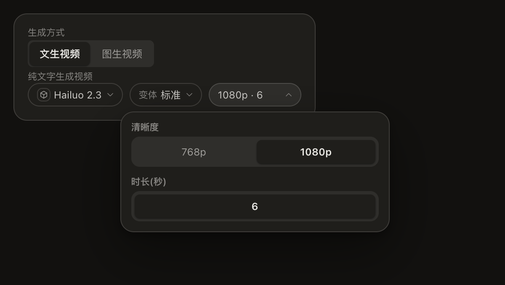
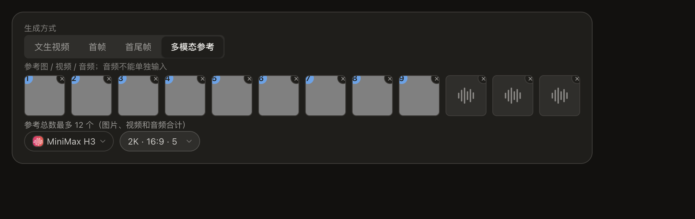

# 模型契约跨字段约束

> 状态：🚧 已实现并通过零额度真实组件走查；最终 gates 与 PR 交付中。

## 范围与验收

修复可复发的组合非法请求：Hailuo 2.3 的 1080p+10s、APIMart MiniMax H3 超过 12 个混合参考。
复用纯共享能力档案，新增条件选项和模式参考总量事实；通用 UI 消费，发送前 transform 纵深拦截。
不改 H3 纯音频限制和 Fast 文生暴露，不跑付费探针，不引入依赖或新协议。
沿用现有参数面板与参考选择器，只收窄选项和容量；任务书已明确交互，截图验收。
回滚：整体 revert 本次提交，派生文件通过既有生成器还原。
验收：红绿单测、Electron tsc、catalog/shared 单测、gates、真实组件截图。

## 先查别人

- 既有共享层调研 `docs/research/2026-08-24-video-capability-shared-layer.md` 明确 params/slots 为唯一事实来源；无现成条件选项语法，不另建 JSON Schema 或供应商 UI。
- MiniMax 官方 https://platform.minimax.io/docs/api-reference/video-generation-i2v ：2026-09-08 实读，2.3/2.3-Fast 的 1080P 仅 6 秒。
- MiniMax 官方 https://platform.minimax.io/docs/guides/video-generation ：2026-09-08 实读 Mixed input is capped at 12 files in total。
- APIMart https://docs.apimart.ai/en/api-reference/videos/minimax-hailuo-2.3/generation.md ：2026-09-08 实读，同样限制 1080p 为 6 秒。
- 仓内 `electron/shared/videoCapabilities/types.ts` 已有 requiresAnyOf；`archetypeMeta.ts` 模式/变体切换夹值、`referenceSlots.ts` 合并连线和上传、`apimartMinimaxH3.ts` 预发送 validator 为可复用近邻。

## 根因与边界

症状是厂商必拒；直接原因是独立 select 与独立 slot.max；类根因是组合不变量未进入共享事实及消费边界。
分类 recurring：UI 编辑、旧 meta、连线/pending、headless 直送均可触发。
字段为内部能力扩展，不改变外部 API；纯函数收窄 options 和计算参考预算，不含供应商分支。
参数切换同步更新非法选值；上传/选择器按已占位总数限制。发送前 validator 从相同事实读取限制，拒绝旧数据/非 UI 非法请求，不静默删参考。

## 待证

H3 audioOnly 拒绝条件在一手文档未见明确依据；Fast 在一手 i2v 页列出，t2v 待核。两者保持原行为，不付费探测。

## 走查证据（2026-09-08）

`node tests/ux/model-contract-limits.walk.mjs` 使用隔离 Electron、真实目录/Store/NodeParameterControls：1080p 仅 6s 且写回；切回 768p 恢复 10s；参考总量 12 禁添加并说明；删除一项恢复。无付费请求。

样张对账：沿用真实控件、布局与 token，未增常驻控件；截图显示 1080p 已选、时长只有 6。参考满额提示展示真实上限，原有参考保留可删除。

补核：MiniMax 一手 t2v 页模型枚举不含 Fast；APIMart Hailuo 文档两次注明 Fast 的 first_frame_image required。依任务要求仅记录待证，不删除现有入口。

H3 补核：2026-09-08 APIMart generation.md 的 Parameter Constraints 明确写 audio_urls Cannot be used alone; must pair with reference image or video。一手 v2-create 文档仍未见对应禁止句。因此现有 audioOnly 对 APIMart 有中转文档依据，是否适用于一手接口仍待证。
