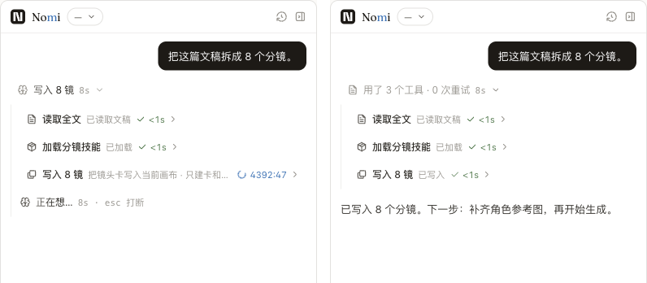

# B2c 样张 / 实现逐项对账

状态：🚧 进行中。实现和真机走查已完成；两张旧品牌基线定向更新已获授权；完整 gates 尚待本轮验证，绿后推送。

真实平台：本分支 Vite renderer + 本分支 Electron 主进程，1440×1000，隔离项目和三类目录；无真实模型调用，费用 0。三态用确定性 host snapshot 驱动真实 ProjectAgentResidentShell，不冒充实际模型生成。调用间 thinking / 回答先于调用的回归另见 process-red.txt 与 unit.txt。

| 批准样张 / 原则 | 实现证据 | 差异与结论 |
|---|---|---|
| 进行中一行，原地换最新步骤 | [并排](compare-running.png) / [真机](process-running-electron.png) | 真实工具能力标签随现役投影显示；不是样张手填文案。一行活状态、已用秒数、展开明细；shimmer 共用 V4Shimmer，[动画收据](motion.json) 验证运行时有动画、减少动态效果后为 0 |
| 完成摘要、回答摊开 | [并排](compare-done.png) / [真机展开](process-done-expanded-electron.png) | 夹具 3 次工具、0 重试、8s；样张调用次数不同。附属与箭头按用户增补紧跟，过程结束自动收起 |
| 失败独立成卡 | [并排](compare-failed.png) / [真机](process-failed-electron.png) | 使用现役 V4ErrorBar；错误原因来自收据，保留明细 |
| 四面统一外框 frames-unified | [四面裁剪](frames-four.png) / [几何收据](electron-receipt.json) | 四面 x=1034、y=72、390×912、radius=10、border=1；样张 y=46 / h=620 是实验室取景尺寸，产品使用真实可用高度 |
| 300–600、共享宽度、刷新恢复 | [300](width-300.png) / [600](width-600.png) / [收据](electron-receipt.json) | 两端键盘与600跨创作/生成/预览保留通过（[预览600](width-600-preview.png)）；鼠标向左 78px，390→468；310 刷新仍为 310。300 下长模型名截断，与批准样张边界一致 |
| NomiBrand / Variable 字体 | [真机](frame-creation.png) / [CDP](electron-receipt.json) | 顶栏与面板复用品牌组件；CDP 实际加载 Fraunces custom font。旧品牌基线因此变化，见下表 |
| 模型三行、无说明、窄框、附属跟随 | [实验室](b2c-model-three-kinds.png) / [Electron](model-electron.png) | 对话 DeepSeek V4 Pro、图片 GPT Image 2、视频 MiniMax H3；实验室与产品共用 buildV4ModelRows。无价格目录不编造单价；已知价格随当前选择由目录派生，单测验证 |

## 红→绿与根因

- [旧投影跑新三态夹具：5 条红](process-red.txt) → [217 单测通过](unit.txt)。原有 B2a 保留回答、不猜正文边界、同名工具组、弹层/取消/审批语义均保留；组位于过程展开区。
- [行尾门岗故意加入 ml-auto：红](row-edge-red.txt)；还原后 check:tokens 绿。AI 硬零，其余按文件存量棘轮，新增未跟踪文件也扫描。
- [持久化红](persistence-red.txt) → [绿](persistence-green.txt)：normalizePayload 原先丢掉整个 editingPanelLayout，现改为 schema 校验后保留，宽度与原有折叠偏好共同恢复。
- 600 切预览原先被独立外层分栏缩成487；删除这层助手 Panel/Separator/同步目标，预览外层也复用 AssistantPane。预览内部布局不变。
- 真机发现 StrictMode 清理尺寸 observer 后未订阅；改为节点驱动 layout effect。四面最终几何与 300/600 交互验证实际 observer 生效。
- #680 模型图片漏行：旧 mechanics 夹具只传对话行，已删掉这份假清单，改用共用目录投影 specimen。
- 自动 feel 报告的字号项来自设计系统允许的 text-micro=11px（含面板状态/单价）及既有导航。人眼检查：改动区无溢出，窄模型名按样张截断。

## 两张品牌基线定向更新（已授权）

| 基线 | 原图 / 实现 / 差异 | 原因 |
|---|---|---|
| ps-14-identity | [旧](ps-14-identity-expected.png) / [新](ps-14-identity-actual.png) / [差异](ps-14-identity-diff.png) | 995 像素；字标从错误回退字体改为 Fraunces Variable，字形与字宽变化 |
| ps-16-preview-host | [旧](ps-16-preview-host-expected.png) / [新](ps-16-preview-host-actual.png) / [差异](ps-16-preview-host-diff.png) | 698 像素；同一品牌字体修复 |

用户已授权仅定向更新以上两张。保留前后图用于 PR 并排；其他旧基线不动，不抬容差、不跳测试，不使用 design-lab:update 全量命令。

## 00:15 过程行底板核查

旧实现无名 group-open 从 Process 传到全部子收据，错误触发灰底与旋转箭头；[修复前真实 Electron 断言失败](no-background-red.txt)。Receipt / ToolGroup / Process 改具名 group 后，进行中/完成/失败的未展开工具行 computed background=transparent、border=0、shadow=none，见 electron-receipt.json。人眼已检查进行中和结束后的完整真机截图；只保留批准样张已有的悬停反馈、主动展开的明细区与左侧引导线。

自查：只改任务书要求；未加入样张外的过程底板、背景框、阴影或额外容器；Message、Panel、V4Row 逐文件核对；冻结区以及 B2d/B2e 未动。
